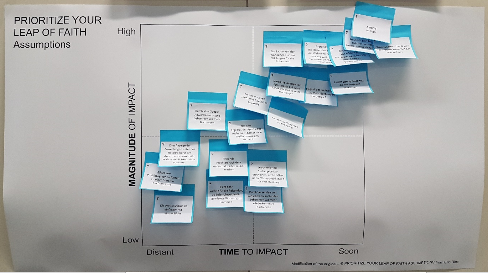

```{r setup, include=FALSE}
knitr::opts_chunk$set(echo = FALSE)   # keine EInbindung des R Quell-Codes

# Laden der Bibliotheken
library(dplyr)
library(readxl)
library(ggplot2)
library(knitr)
library(plotly)

htmlOutput <- FALSE  
```

# Einführung

Ziel der Workshops ....

# Datenbasis

Die Daten stammen aus Workshops zum Thema *Business Validation Workshops* und 
basieren auf Posotionen von Post-Its. Die Post-Its erfassen die Wichtigkeit einzelner
Annahmen bzgl. der Dimension *timeToImpact* und *magnitudeToImpact*:

<!--  -->

```{r einlesenDaten}
dat <- read_excel("../Data/Assumption.xls")
```

Die Daten bestehen aus `r nrow(dat)` Zeilen. Diese setzen sich zusammen aus

  - `r dat$Pid %>% unique %>% length` Annahmen
  - `r dat$Team %>% unique %>% length` Teams

## Untersuchte Annahmen

```{r tabAnnahmen}
mapTabIdAnnahme <- dat %>% 
  select(Pid, `AirBnB Assumptions in German`) %>% 
  distinct
  
```

Folgende Annahmen wurden bzgl. der o.g. Dimensionen bewertet:

```{r printAnnahmen}
mapTabIdAnnahme %>% 
  kable
```


# Deskriptive Statistik

## Teams

Die folgenden Abschnitte zeigen, welche Bewertungen die einzelnen Teams vorgenommen haben.

```{r loopTeamsDeskr, results='hide'}
out <- NULL
for(TeamId in unique(dat$Team)){
  
  out <- c(out, knit_child(input = "02a_childTeamStats.Rmd", quiet = TRUE))
  
}

```
`r paste(knit(text = out, quiet = TRUE), collapse = "\n")`

# Analyse

```{r aggrStats}
datAggr <- dat %>%
  group_by(Pid, `AirBnB Assumptions in German`) %>% 
  summarise(meanX = mean(TimeToImpact),
            seX = sd(TimeToImpact)/sqrt(n()),
            meanY = mean(MagnitudeToImpact),
            seY = sd(MagnitudeToImpact)/sqrt(n()))
  
```


```{r plotAggrStats}
p <- datAggr %>% 
  mutate(xmin = meanX - 2 * seX,
         xmax = meanX + 2 * seX,
         ymin = meanY - 2 * seY,
         ymax = meanY + 2 * seY) %>% 
  ggplot(aes(x = meanX, xmin = xmin, xmax = xmax,
             y = meanY, ymin = ymin, ymax = ymax,
             label = Pid,
             text = `AirBnB Assumptions in German`)) +
  geom_point() +
  geom_errorbar() +
  geom_errorbarh() +
  geom_text(hjust = 0, vjust = 0)

```

```{r staticPlot, eval = !htmlOutput}
p
```


```{r interactivePlot, eval = htmlOutput}
p %>% 
  ggplotly()
```


# Weitere Infos:

- plotly: (https://plot.ly/r/)